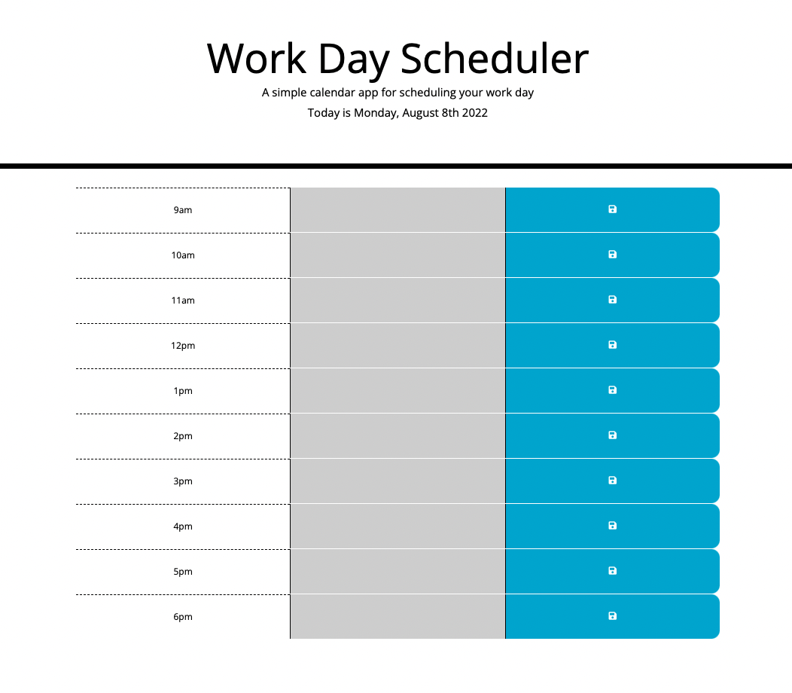
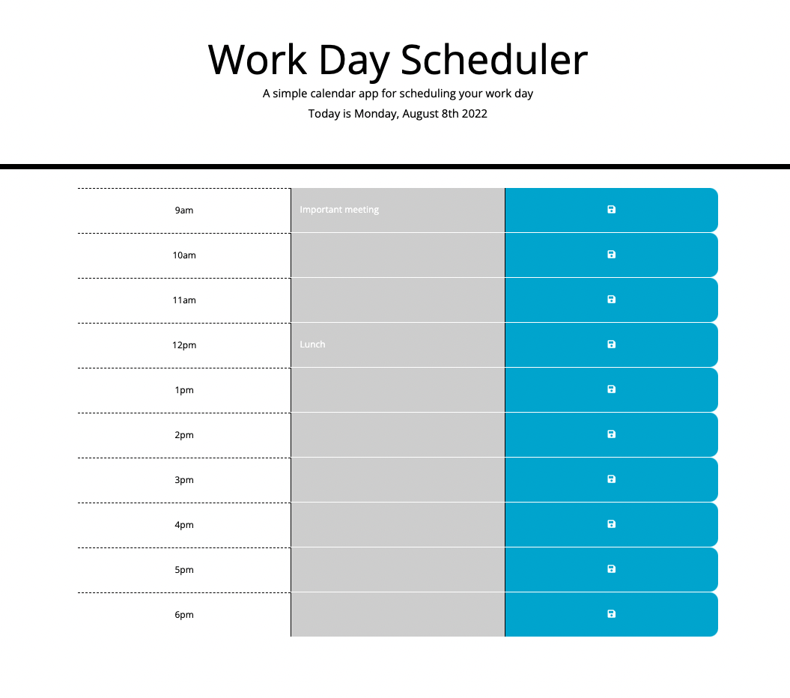

# Scheuduling App
Here's what the code does:

Index.html houses the main structure of the schedule
Style.css handles the styling
Script.js handles the logic for the schedule itself
Moment.js handles the timing

When you load the page, you'll see a schedule for the hours of 9am - 6pm. Depending on the current time of day local to you, you'll see each time slot description in gray (past), red (present) or green (future). You can enter a description and save it via localStorage. Enjoy.

View the site here: https://makeithappenmike.github.io/scheduling-app/

Contributions by Michael Martens

Screenshot:

 

